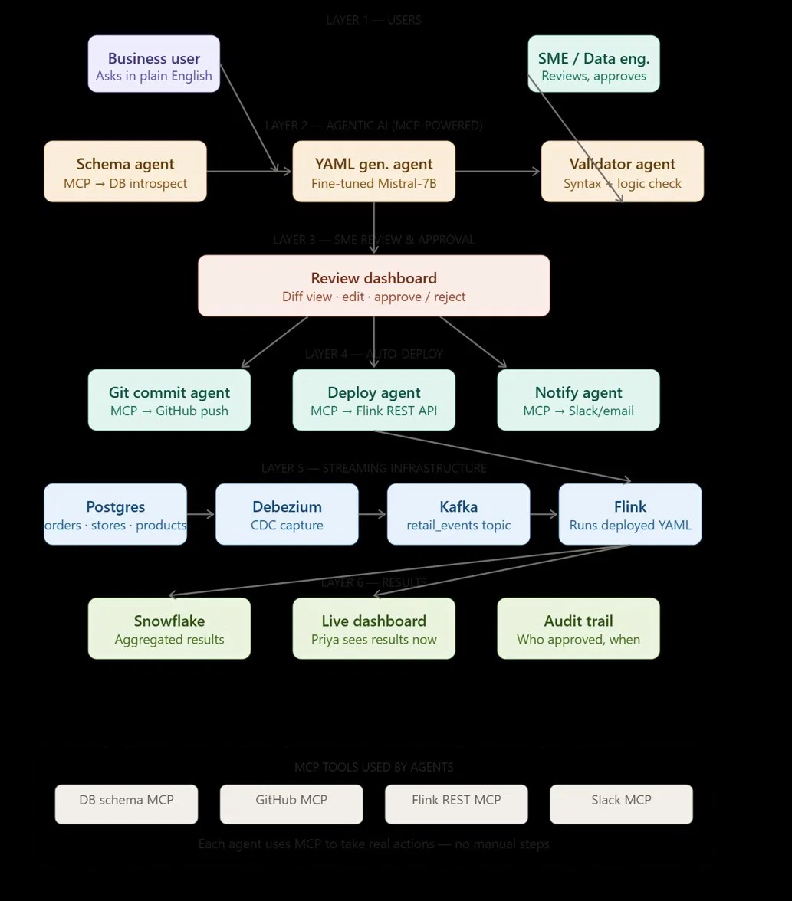
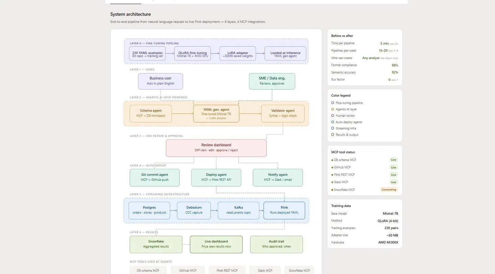

# nl2flink / MegaStore Pulse — AI Pipeline Studio

> **Ask in plain English. Get a production streaming pipeline.**
> A fine-tuned 14B LLM and an agentic MCP system that translate natural-language business questions into validated, production-ready Apache Flink pipelines — with a human engineer in the loop and fully automated deployment.

---

## 📸 Architecture Diagrams

### 6-Layer Agentic Architecture


### System Flow & Infrastructure Layout


---

## 📌 The Problem

In most data teams, real-time analytics is locked behind a small group of streaming engineers.

When a business user wants a live answer — *"sales by category in the last 10 minutes,"* *"alert me when returns spike in any region"* — they can't get it themselves. Someone has to hand-write a streaming pipeline: define the Flink job, wire up the Kafka topics, configure the CDC source, get the windowing and aggregation syntax exactly right, test it, and deploy it.

That creates four problems:
- **It's slow.** A single pipeline takes hours of engineering time from request to live data.
- **It's a bottleneck.** Only one or two people on the team can write these pipelines, so requests queue up and throughput is capped at a handful per week.
- **It's fragile.** When the person who knows the streaming stack is unavailable, *nothing ships* — a bus factor of one.
- **It's gated by expertise.** Business users understand the question; they don't know Flink, Kafka, CDC, or YAML. The knowledge gap is the wall.

The result: the people who need real-time data are blocked, and the people who can deliver it are buried.

---

## 💡 The Solution

**nl2flink / MegaStore Pulse** removes the bottleneck without removing the safety net.

A business user asks a question in plain English. A **fine-tuned 14B-parameter LLM** generates a production-grade Flink pipeline definition. A chain of **agents** introspects the live database schema, validates the output, and self-corrects on failure. A **human engineer reviews and approves** the generated pipeline before anything goes live — and once approved, **MCP agents deploy it automatically** to the streaming stack and notify the requester.

The business user self-serves. The engineer reviews instead of writes. Real-time pipelines that used to take hours ship in minutes — and the bus-factor problem disappears, because the knowledge now lives in the model, not in one person's head.

---

## 🛠️ Repository Directory Structure

```
MegaStore-Finetunning/
├── README.md               # Comprehensive documentation (this file)
├── requirements.txt        # Python packages for backend, frontend, and model server
├── .gitignore              # Ignored local virtual environments & large model binaries
├── streamlit_app.py        # Streamlit frontend entrypoint (topbar + persona routing)
├── backend_mock.py         # Mock FastAPI backend serving SSE stream and mock pipeline status
├── generate_snapshot.py    # Generates static HTML previews of the personas
├── .env.example            # Environment variables configuration template
│
├── api/                    # Frontend HTTP/SSE client layer
│   ├── __init__.py
│   └── client.py
│
├── components/             # Reusable UI component HTML wrappers
│   ├── __init__.py
│   ├── answer_card.py      # Priya's KPI and interactive charts
│   ├── journey_trail.py    # Real-time state trail
│   ├── monitor_panel.py    # Flink metrics monitor & terminal log stream
│   ├── review_card.py      # Arjun's diff view, checks, and approve buttons
│   ├── sidebar.py          # Left history navigation bar
│   └── topbar.py           # Top navigation bar
│
├── views/                  # UI Persona Views
│   ├── __init__.py
│   ├── business_view.py    # Business persona UI (Priya)
│   └── engineer_view.py    # Engineer persona UI (Arjun)
│
├── utils/                  # UI helper utilities
├── assets/                 # Custom CSS overrides for native Streamlit styling
│   └── style.css
│
├── dataset/                # Curated dataset for model fine-tuning
│   ├── dataset-1035.json
│   └── dataset-1800.json
│
├── schema/                 # Ground truth relational database schemas
│   └── megastore_complete_schema.sql
│
├── training/               # Fine-tuning notebooks and scripts
│   ├── fine_tuning.ipynb   # QLoRA (4-bit) fine-tuning pipeline
│   ├── safe_generate.py    # Custom token-level inference script
│   └── demo.py             # CLI generation playground
│
├── model_server/           # Model deployment files
│   ├── model.py            # Local inference verification script
│   └── model_server.py     # FastAPI model host wrapper
│
└── docs/                   # Supporting slide-decks and design documents
    ├── Hackathon.pptx      # Slide deck for presentation
    └── images/             # Documentation visuals
        ├── architecture_layout.jpeg
        └── architecture_diagram.jpeg
```

---

## ⚡ How It Works (7 Layers)

### Layer 0 — Fine-Tuning
A 14B-parameter open-weight LLM is fine-tuned with **QLoRA (4-bit)** on a curated set of 230 *(question → Flink YAML)* pairs, producing a lightweight (~50 MB) LoRA adapter loaded at inference time.

### Layer 1 — Users
- **Business user (Priya)** — asks a question in plain English.
- **SME / Data engineer (Arjun)** — reviews and approves generated pipelines.

### Layer 2 — Agentic AI (MCP-powered)
- **Schema agent** — introspects live table/column context via the DB Schema MCP.
- **Generation agent** — the fine-tuned LLM converts the question into Flink pipeline YAML.
- **Validator agent** — runs a 3-layer check (YAML syntax → schema field existence → Flink config rules) and triggers an LLM **self-correction loop** (up to 3 retries) on failure.

### Layer 3 — Human-in-the-Loop Review
A review dashboard shows the SME the original question, the generated YAML (diff view), the validation results, and the self-correction log. **Nothing deploys without an explicit approve click.**

### Layer 4 — Auto-Deploy (triggered only after approval)
- **Git commit agent** — pushes the approved YAML to GitHub (MCP).
- **Deploy agent** — submits the job to the Flink REST API (MCP).
- **Notify agent** — messages the requester via Slack/email (MCP).

### Layer 5 — Streaming Infrastructure
`PostgreSQL → Debezium (CDC) → Kafka → Flink` — the deployed YAML runs as a live Flink job over the change-data-capture stream.

### Layer 6 — Results
- **Snowflake** — aggregated results sink.
- **Live dashboard** — the requester sees results in real time.
- **Audit trail** — who approved what, and when.

---

## 📈 Key Results

| Metric | Before | After |
|---|---|---|
| Time per pipeline | ~2 hours | **~5 minutes** |
| Pipelines per week | 3–4 | **15–20** |
| Who can create one | 1 engineer | **Any analyst** |
| Bus factor | 1 | **0** |
| Format compliance | — | **98%** |
| Semantic accuracy | — | **92%** |

---

## 🎯 Fine-Tuning Details

| Field | Configuration / Hardware |
|---|---|
| **Base model** | Qwen2.5-14B or Phi-4 |
| **Method** | QLoRA (4-bit) |
| **Training examples** | 230 *(question → Flink YAML)* pairs |
| **Adapter size** | ~50 MB |
| **Hardware** | AMD Instinct MI300X (192 GB HBM3, CDNA 3) |
| **Software stack** | ROCm |
| **Precision support** | FP16 / BF16 / FP8 |

> The MI300X's 192 GB of HBM3 and ROCm stack provided the headroom to fine-tune and serve the model end-to-end on a single accelerator.

---

## 🛠️ Tech Stack

| Layer | Technology |
|---|---|
| **Model** | Fine-tuned 14B LLM (QLoRA adapter) |
| **Agents / Orchestration** | Custom MCP servers |
| **Backend** | FastAPI (Python) |
| **Streaming** | PostgreSQL · Debezium (CDC) · Kafka · Apache Flink |
| **Warehouse** | Snowflake |
| **Frontend** | Streamlit |
| **Training** | QLoRA (4-bit) on AMD Instinct MI300X (ROCm) |

---

## 🔌 MCP Tools

The agents take real actions through five Model Context Protocol servers — no manual steps:

| Tool | Purpose |
|---|---|
| **DB Schema MCP** | Fetches live table/column context for grounded generation |
| **GitHub MCP** | Commits approved pipeline YAML |
| **Flink REST MCP** | Submits and manages streaming jobs |
| **Slack MCP** | Notifies users on key events |
| **Snowflake MCP** | Verifies sink tables |

---

## 🚀 Getting Started

### 1. Requirements Installation
```bash
cd MegaStore-Finetunning
pip install -r requirements.txt
```

### 2. Run the FastAPI Backend Mock
The backend mock manages pipeline configurations and runs local inference:
```bash
uvicorn backend_mock:app --port 8000 --reload
```

### 3. Run the Streamlit Frontend UI
In a separate terminal, launch the client app:
```bash
streamlit run streamlit_app.py
```

### 4. Deploying the GPU Model Server (Optional)
If running in an environment with GPU acceleration, you can host the fine-tuned adapter:
```bash
# Set model directory or defaults to training/
python model_server/model_server.py
```

---

## 📝 License

Released under the MIT License. See [LICENSE](LICENSE) for details.
